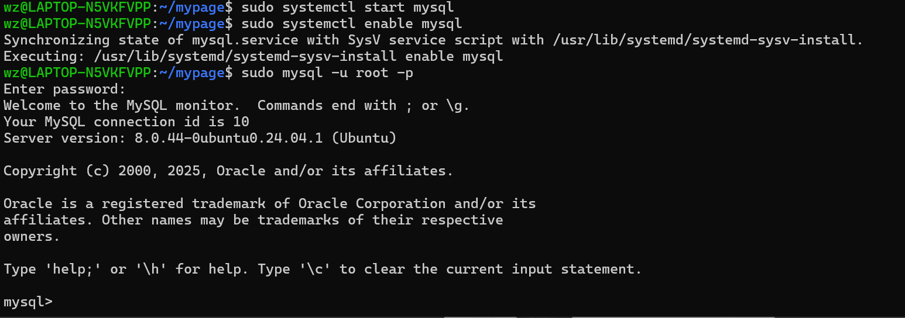

+++
title = "Linux系统配置安装MySQL"
draft = false
date = "2025-12-01"
tags = ["学习","数据库"]
+++

# MySQL 安装

安装 MySQL
对于基于 Debian 的系统（如 Ubuntu）:

```bash
sudo apt update
sudo apt install mysql-server
```

对于基于 Red Hat 的系统（如 CentOS）:

```bash
sudo yum install mysql-server
```

# 安全配置

```bash
sudo mysql_secure_installation
```


这里会让你选密码等级，我选的 2（最高等级）。

# 细节配置

然后会有一系列介绍，全选 y 也没问题，下面是选项的一些解释。

1. 匿名用户
   
   默认情况下，MySQL 安装完成后会创建一个匿名用户，这个用户可以无需账户就能登录 MySQL。这通常用于测试或简化安装过程，但如果你打算将 MySQL 用于生产环境，则强烈建议你删除这个匿名用户，以确保安全性。

2. 禁止 root 用户的远程登录
   
   MySQL 的 root 用户被设置为只能从 localhost（本地）登录，这是一种安全措施，防止黑客通过网络尝试猜测 root 密码。如果允许 root 远程登录，系统将面临更大的安全风险，尤其是在生产环境中。因此，通常建议禁止 root 的远程登录，只允许其在服务器本地进行操作。

3. 默认的 test 数据库
   
   MySQL 默认会创建一个名为 test 的数据库，任何用户都可以访问它。这个数据库主要用于测试目的，并不具备严格的访问控制。

4. 重新加载权限表
   
   MySQL 的权限表（privilege tables）存储了所有用户的权限信息。进行用户管理、更改权限、删除匿名用户等操作后，需要重新加载这些表，才能使更改生效。这个过程不会中断 MySQL 服务，只是让你所做的更改立刻生效。

# 启动 MySQL 服务

```bash
sudo systemctl start mysql
sudo systemctl enable mysql
```


如图，成功启动

# 基本使用

```bash
create database helloworld; #创建数据库：create database 数据库名
show databases;#查看已存在的数据库，一般会默认存在些

use helloworld; #使用表

create table student( #创建初始表格
name varchar(32),
age int,
gender varchar(2)
);

show tables;#查看创建好的表

insert into student(name,age,gender) value('张三',20,'男'); #插入数据到表格中：

select * from student;#查看表的内容
```

建立数据库，本质就是创建一个文件，一顿操作下来如图，成功使用。

